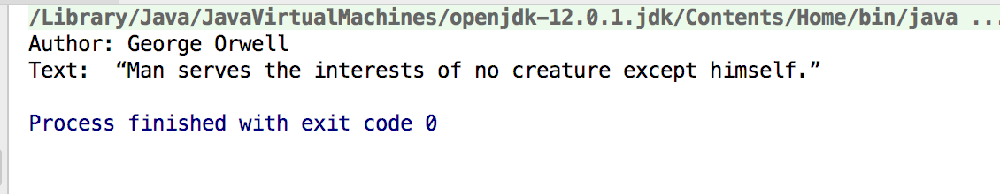
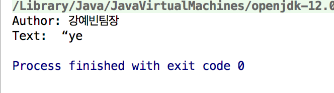
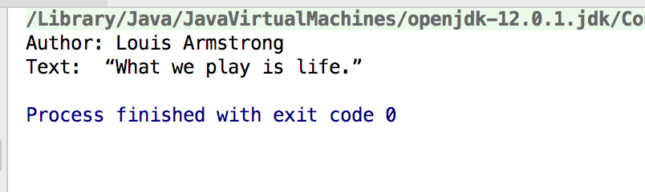

# javaquotes

_Using Gson to convert from json to object

References:
https://github.com/google/gson

This repo includes two main classes:

App: main()

     getResults(): pass in a filepath and return the result user want which includes author and text
     
Quote: tags;
       author;
       likes;
       text;
       

Examples:

Each time click run button will generate a random result with "Author" and "Text"

Tests:

QuoteTest: including all tests for getters and setters

AppTest: test the getResults() in the app 